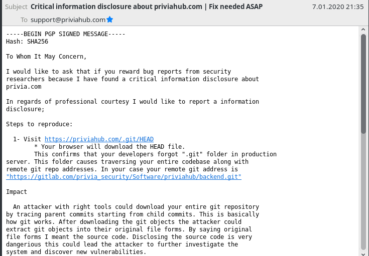

On Tuesday of 7th Jan, 2020. I have found a critical information disclosure on a website of a cyber security firm called PriviaHub.

I sent two emails to them about this. They never answered to me but this issue seems to be fixed. Therefore I hereby disclose this issue.



Here is my original report email,

```
To Whom It May Concern,

I would like to ask that if you reward bug reports from security
researchers because I have found a critical information disclosure about
privia.com

In regards of professional courtesy I would like to report a information
disclosure;

Steps to reproduce:

  1- Visit https://priviahub.com/.git/HEAD
	* Your browser will download the HEAD file.
	This confirms that your developers forgot ".git" folder in production
server. This folder causes traversing your entire codebase along with
remote git repo addresses. In your case your remote git address is
"https://gitlab.com/privia_security/Software/priviahub/backend.git"

Impact

  An attacker with right tools could download your entire git repository
by tracing parent commits starting from child commits. This is basically
how git works. After downloading the git objects the attacker could
extract git objects into their original file forms. By saying original
file forms I meant the source code. Disclosing the source code is very
dangerous this could lead the attacker to further investigate the
system and discover new vulnerabilities.

Fix

  Remove ".git" folder from production side.


I am waiting for your response.
Best regards,
The Avatar
```

I have downloaded only two commit metadata in order to prove the information disclosure. I am sorry to see that they didn't answer my emails.